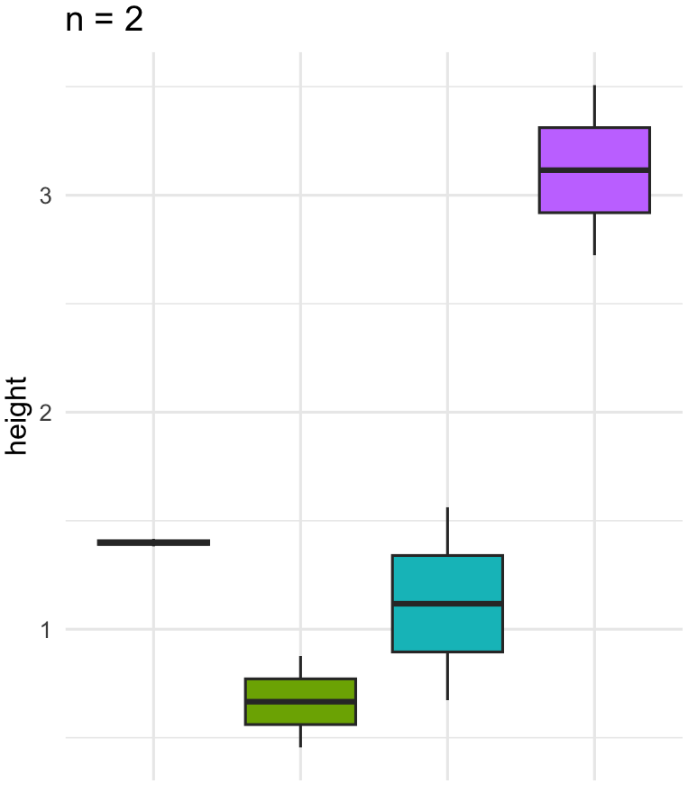
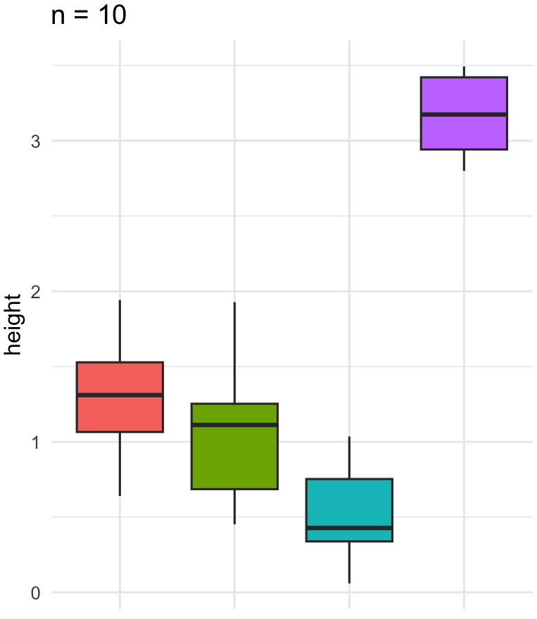
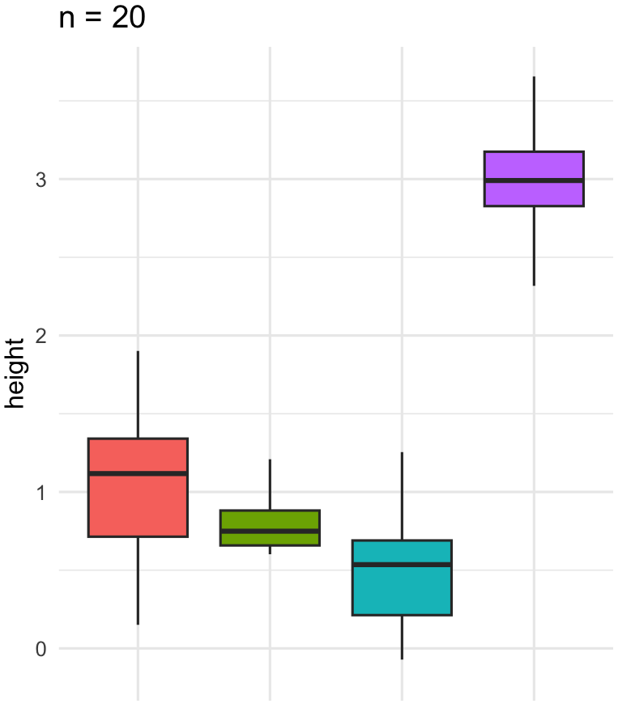
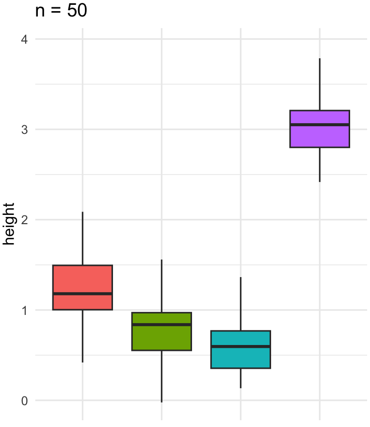
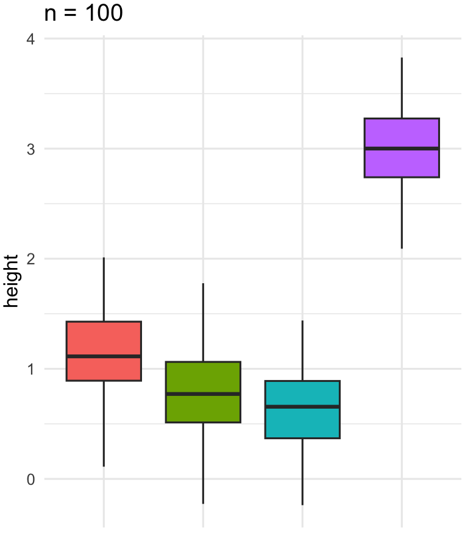
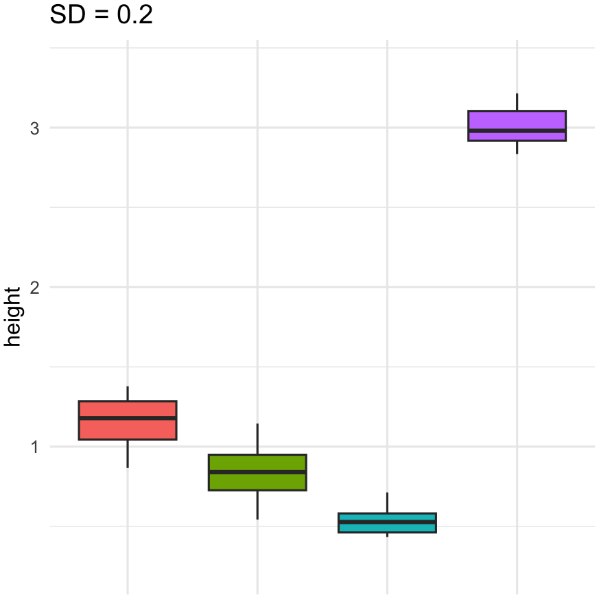
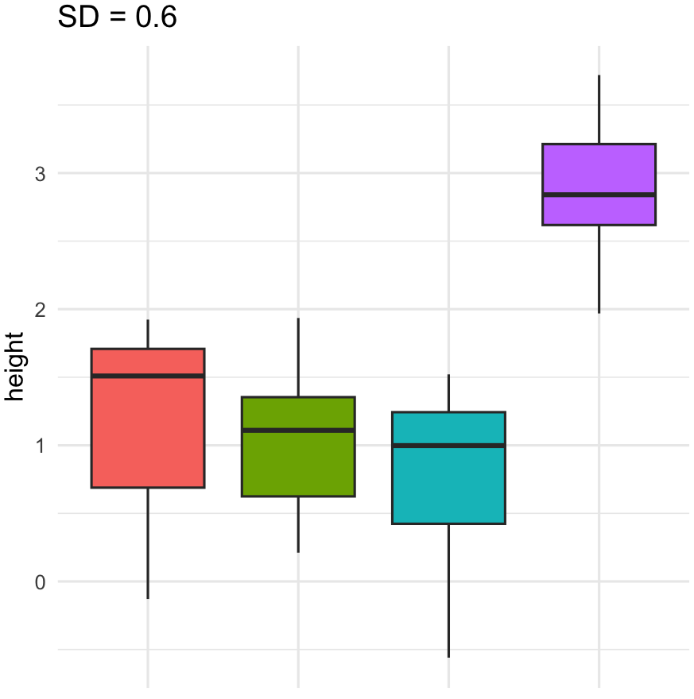
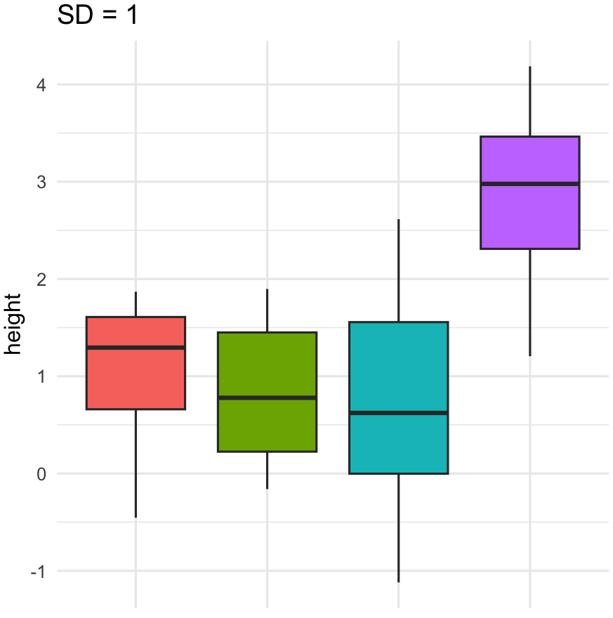

```{r setup, include=FALSE}
knitr::opts_chunk$set(echo = TRUE)
```

# Creating Fake Data Sets To Explore Hypotheses

### Introduction to Data

The data set created for this assignment is based on an independent research project studying the developmental and behavioral impacts of nicotine exposure in Drosophila melanogaster. One metric this study investigates how exposure to different nicotine concentrations affects pupation height which serves as a proxy for developmental fitness.

**Pupation height** refers to the vertical distance at which larvae choose to pupate along the walls of the vial. Lower pupation height is associated with developmental stress and toxicity. The dataset is modeled after previously collected experimental data where nicotine exposure significantly reduced pupation height in a dose-dependent manner.

**Hypothesis** : Developmental nicotine exposure reduces pupation height in a dose-dependent manner, with higher concentrations leading to greater reductions in pupation height.

**Experimental Groups** : Control (0.0 μg/mL) \| 0.1 μg/mL \| 0.5 μg/mL \| 1.0 μg/mL

### Building the Data Set

Sample size (`sampleS`) is randomly chosen between 5 and 20 per treatment\
Each treatment (`nic_dose`) has a corresponding mean (`means`) pulled from the actual experimental data\
Pupation height values (`height`) are generated using the rnorm() function for normally distributed data with the specified means and variance

```         
sampleS <- floor(runif(1, min = 5, max = 20))
nic_dose <- rep(c("ctrl", "0.1", "0.5", "1.0"), each = sampleS)
means <- rep(c(3.03, 1.20, 0.86, 0.6), each = sampleS)
height <- rnorm(length(nic_dose), mean = means, sd = 0.4)

nic_data <- data.frame(nic_dose,height)
print(nic_data)
```

### Analysis

A one-way ANOVA was used to determine if there is a statistically significant difference in pupation height between nicotine exposure groups

```         
nicAOV <- aov(height ~ nic_dose, data = nic_data)
nic_summary <- summary(nicAOV)

p_value <- nic_summary[[1]][["Pr(>F)"]][1]
cat("ANOVA p-value:", p_value, "\n")
```

**ANOVA p-value**: 1.153513e-29

```         
ggplot(data = nic_data, aes(x = nic_dose, y = height)) +
  geom_boxplot(fill = "#303E4E", color = "black") +
  labs(title = "Pupation Height Across Nicotine Treatments", x = "Nicotine Dose (μg/mL)", y = "Pupation Height (cm)") +
  theme_minimal()
```

{width="445"}

### Exploring Parameters

How does sample size effect significance and distribution?

```         
sample_sizes <- c(2, 10, 20, 50, 100)

for (i in sample_sizes) {
  cat("Sample size =", i, "\n")
  
  # Generate data
  nic_dose <- rep(c("ctrl", "0.1", "0.5", "1.0"), each = i)
  means <- rep(c(3.03, 1.20, 0.86, 0.6), each = i)
  height <- rnorm(length(nic_dose), mean = means, sd = 0.4)
  nic_data <- data.frame(nic_dose, height)
  
  # Run ANOVA and extract p-value
  nicAOV <- aov(height ~ nic_dose, data = nic_data)
  p_value <- summary(nicAOV)[[1]][["Pr(>F)"]][1]
  
  # Print the p-value
  cat("P-value:", p_value, "\n\n")
  
  # Generate and print the boxplot
  box_plot <- ggplot(nic_data, aes(x = nic_dose, y = height, fill = nic_dose)) +
    geom_boxplot(outlier.shape = NA) + 
    theme_minimal() +
    theme(legend.position = "none",
          axis.title.x = element_blank(),
          axis.text.x = element_blank(),
          axis.ticks.x = element_blank(),
          plot.margin = margin(2, 2, 2, 2)) +
    ggtitle(paste("n =", i))
  
  print(box_plot)  
}
```

|  |  |  |
|:----------------------:|:----------------------:|:----------------------:|
| Sample Size (n) | P value | Plot |
| 2 | 0.01925821 | {width="95"} |
| 10 | 4.617667e-17 | {width="95"} |
| 20 | 3.063626e-31 | {width="92"} |
| 50 | 5.631647e-87 | {width="94"} |
| 100 | 2.631361e-162 | {width="94"} |

**How does the standard deviation effect significance and distribution?**

```         
multiplier <- c(0.5, 1.5, 2.5)

for (i in multiplier) {
  cat("Standard Diviation =", 0.4*i, "\n") 
  
  # Generate data
  nic_dose <- rep(c("ctrl", "0.1", "0.5", "1.0"), each = sampleS)
  means <- rep(c(3.03, 1.20, 0.86, 0.6), each = sampleS)
  height <- rnorm(length(nic_dose), mean = means, sd = 0.4*i)
  nic_data <- data.frame(nic_dose, height)
  
  # Run ANOVA and extract p-value
  nicAOV <- aov(height ~ nic_dose, data = nic_data)
  p_value <- summary(nicAOV)[[1]][["Pr(>F)"]][1]
  
  # Print the p-value
  cat("P-value:", p_value, "\n\n")
  
  # Generate and print the boxplot
  box_plot <- ggplot(nic_data, aes(x = nic_dose, y = height, fill = nic_dose)) +
    geom_boxplot(outlier.shape = NA) + 
    theme_minimal() +
    theme(legend.position = "none",
          axis.title.x = element_blank(),
          axis.text.x = element_blank(),
          axis.ticks.x = element_blank(),
          plot.margin = margin(2, 2, 2, 2)) +
    ggtitle(paste("SD =", 0.4*i))
  
  print(box_plot)  
}
```

|  |  |  |
|:----------------------:|:----------------------:|:----------------------:|
| Adjusted Standard Diviation | P-value | Plot |
| 0.2 | 8.848216e-43 | {width="98"} |
| 0.6 | 5.691976e-14 | {width="98"} |
| 1.0 | 6.16687e-08 | {width="98"} |
